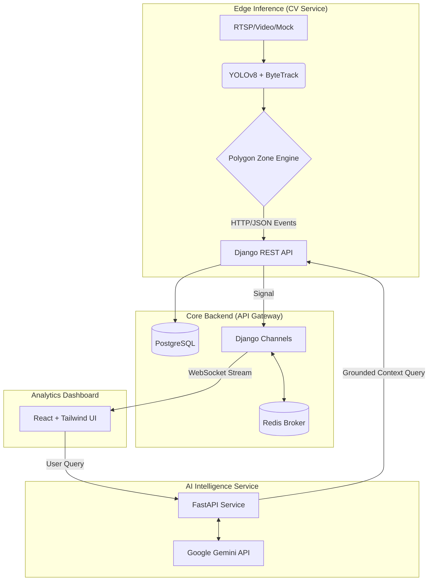

# RetailMind: Smart Retail Intelligence Platform

[](https://opensource.org/licenses/MIT)
[](https://www.python.org/downloads/release/python-3110/)
[](https://reactjs.org/)
[](https://www.docker.com/)

RetailMind is a production-grade, AI-powered retail analytics ecosystem designed to transform raw video data into actionable business intelligence. Built with a distributed microservices architecture, it combines Computer Vision (YOLOv8), Real-time Event Streaming (WebSockets), and Generative AI (Google Gemini) to provide store managers with deep behavioral insights.

---

## 🏗 System Architecture

RetailMind is built as a distributed system of specialized microservices, ensuring scalability and fault isolation.



### 🧩 Service Overview
- **CV Service:** Edge inference node. Performs object detection, multi-object tracking, and spatial polygon analysis (Point-in-Polygon).
- **Backend Service:** The central source of truth. Manages metadata, persists events in PostgreSQL, and handles real-time broadcasting via Redis.
- **AI Service:** The platform's "brain." Uses Gemini 1.5 Flash to reason over structured analytics data for natural language business intelligence.
- **Frontend Dashboard:** A modern SaaS-style interface for real-time monitoring and historical reporting.

---

## 🚀 Key Features

### 1. Spatial Intelligence
- **Polygon-Based Zones:** Define complex retail zones (Entrance, Aisle, Checkout) using custom polygonal coordinates.
- **Dwell Time Tracking:** Automatically calculate how long customers stay in specific areas.
- **Zone Transitions:** Monitor customer flow patterns through the store layout.

### 2. Real-time Analytics
- **WebSocket Synchronization:** Sub-second latency from edge detection to dashboard update.
- **Occupancy Management:** Live tracking of current store density and traffic bursts.
- **Activity Feed:** A granular audit log of every retail event (Entry, Exit, Zone Move).

### 3. AI Insights Assistant
- **Natural Language Querying:** Ask Gemini about your store's performance (e.g., *"Summarize aisle engagement today"*).
- **Grounded Reasoning:** AI responses are strictly anchored in your store's actual PostgreSQL metrics to prevent hallucinations.

---

## 🛠 Tech Stack

- **Computer Vision:** Ultralytics YOLOv8, OpenCV, ByteTrack, Shapely.
- **Backend:** Python 3.11, Django, Django REST Framework, Django Channels.
- **Frontend:** React, Vite, Tailwind CSS, Recharts, Lucide Icons.
- **Datastores:** PostgreSQL (Persistence), Redis (Pub/Sub & Channel Layer).
- **AI/LLM:** Google Gemini 1.5 Flash API.
- **Infrastructure:** Docker, Docker Compose, Healthchecks.

---

## 📦 Setup & Installation

### Prerequisites
- Docker & Docker Compose
- Google Gemini API Key (Optional, for AI features)

### Quick Start
1. **Clone the repository:**
   ```bash
   git clone https://github.com/yourusername/RetailMind.git
   cd RetailMind
   ```

2. **Configure Environment:**
   ```bash
   cp .env.example .env
   # Add your GEMINI_API_KEY to .env for AI insights
   ```

3. **Launch the Platform:**
   ```bash
   docker-compose up --build
   ```

4. **Access:**
   - **Dashboard:** [http://localhost:3000](http://localhost:3000)
   - **API Docs:** [http://localhost:8000/api/v1/analytics/](http://localhost:8000/api/v1/analytics/)

---

## 🗺 Roadmap
- [ ] **Phase 4:** Multi-camera synchronization & Re-identification (Re-ID).
- [ ] **Phase 5:** Automated Heatmap generation using coordinate distribution.
- [ ] **Phase 6:** Predictive analytics for staffing optimization based on historical trends.

## 📜 License
This project is licensed under the MIT License - see the [LICENSE](LICENSE) file for details.
