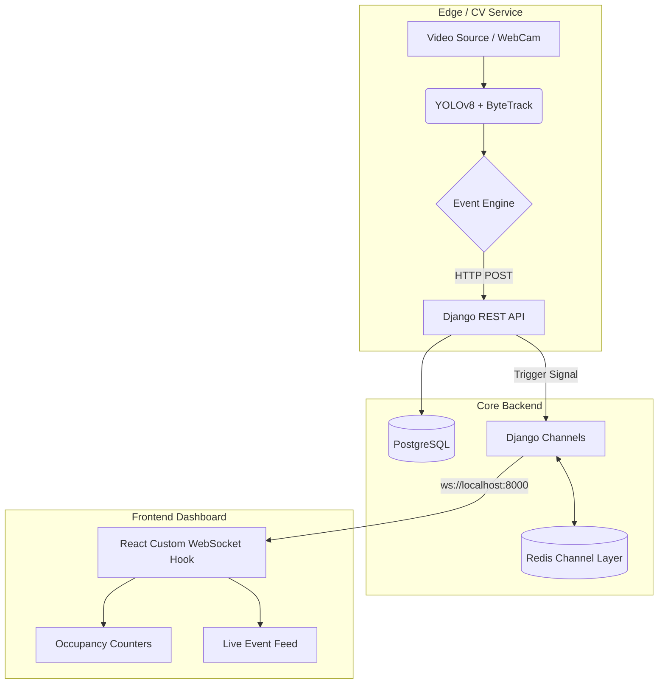

# Phase 1 Validation & Startup Guide

## 1. Startup Instructions

### Prerequisites
Make sure you have Docker and Docker Compose installed on your system.

### Starting the System
1. Open a terminal in the root directory (`RetailMind/`).
2. If you don't have a webcam or video file configured, the system will default to **MOCK mode** to generate simulated occupancy events.
3. Build and start the cluster:
   ```bash
   docker-compose up --build
   ```
4. Access the different services:
   - **Frontend Dashboard:** [http://localhost:3000](http://localhost:3000)
   - **Backend API:** [http://localhost:8000/api/v1/analytics/events/](http://localhost:8000/api/v1/analytics/events/)

## 2. Service Dependency Order
Docker Compose orchestrates the startup sequence automatically using `depends_on`, but internally the services spin up in this critical order:
1. **PostgreSQL & Redis:** Foundational datastores. Must be ready before the backend starts.
2. **Django Backend:** Waits for PostgreSQL via `entrypoint.sh`. Once connected, it applies migrations, creates initial test data (`Store ID=1`, `Camera ID=1`), and opens the REST/WebSocket ports.
3. **CV Service:** Depends on the backend. It will begin running inference (or mock loops) and actively POSTing events to the backend.
4. **React Frontend:** Independent startup, but requires the backend WebSocket server to render live data.

## 3. Architecture Diagram



## 4. API & Event Flow Explanation
1. **Detection & Tracking:** The `cv_service` processes video frames (or runs a simulated loop), maintaining bounding boxes and track IDs.
2. **Event Translation:** If a new track ID appears, the `EventEngine` generates an `ENTRY` event. If the total number of track IDs changes, an `OCCUPANCY_UPDATE` event is generated.
3. **Data Ingestion:** `cv_service/APIClient` sends a POST request to `http://backend:8000/api/v1/analytics/events/` with the event JSON.
4. **Persistence & Broadcast:** The Django `AnalyticsEventViewSet` intercepts the data, passes it to the `AnalyticsService` which saves it to PostgreSQL, and immediately pushes a message to the `analytics_1` Redis group.
5. **Real-time UI:** The React frontend, listening via `useWebSocket`, parses the incoming JSON and triggers state updates for Recharts and Tailwind widgets instantly.

## 5. Known Limitations (Phase 1)
- **Zone Logic Placeholder:** Current events simulate basic occupancy. Actual spatial polygon checking (e.g., checking if point `x,y` is inside `Zone A`) needs to be fully implemented.
- **Track Exit Logic:** The system correctly detects entries, but robust exit events require checking when an active track ID disappears from the frame for more than $N$ frames.
- **Hardcoded IDs:** For prototyping, the CV service currently pushes to `Store 1` and `Camera 1`. Multi-tenant/multi-camera environments will require dynamic fetching of configuration data.

## 6. Next Engineering Priorities (Phase 2 & 3)
- **Phase 2 (Advanced CV):** Implement RayCasting or Shapely logic in the CV Service to determine when bounding box centroids cross virtual polygonal zones (e.g., "Aisle 3"). Add Heatmap generation logic.
- **Phase 3 (AI/LLM Integration):** Integrate LangChain and ChromaDB. Use Gemini to query the PostgreSQL event table, allowing users to ask: *"What was the busiest hour yesterday?"* and get natural language summaries.
